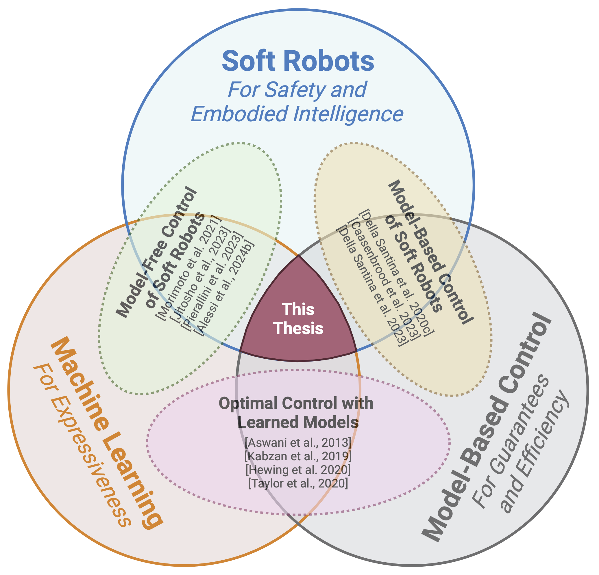
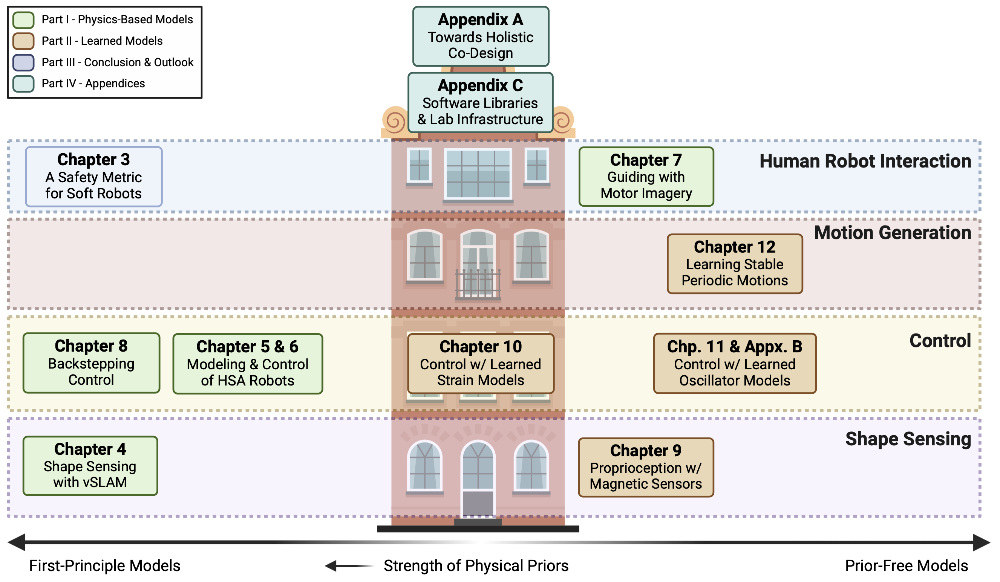
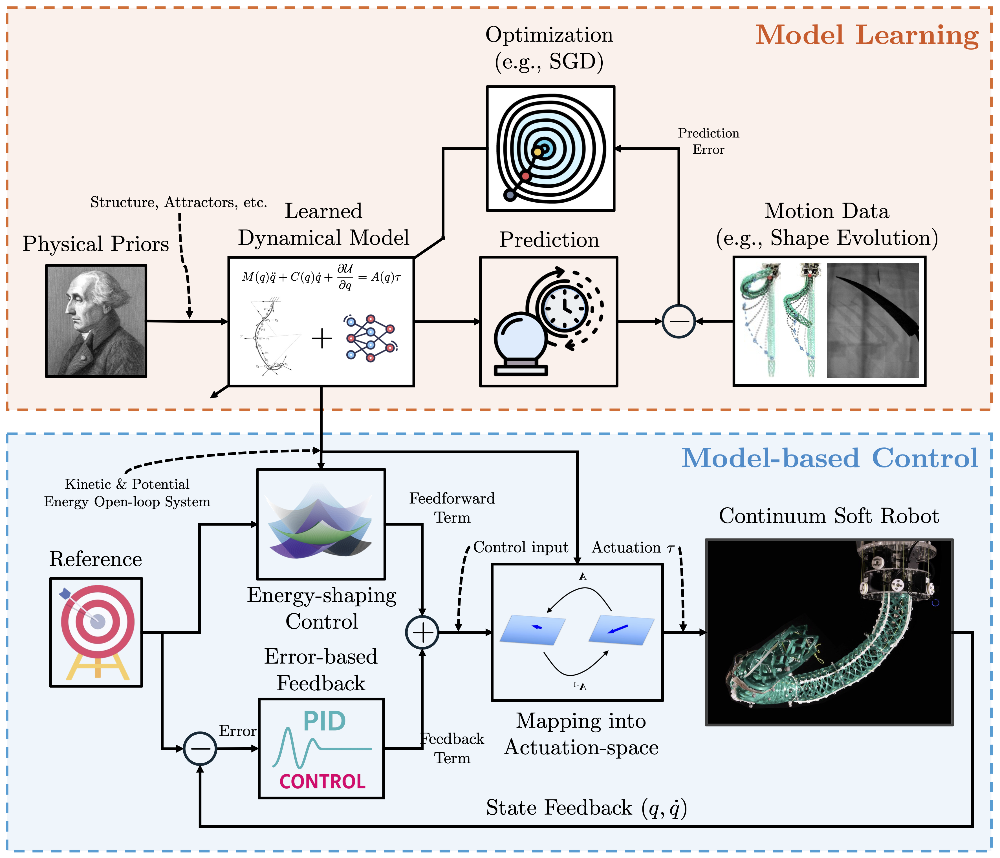
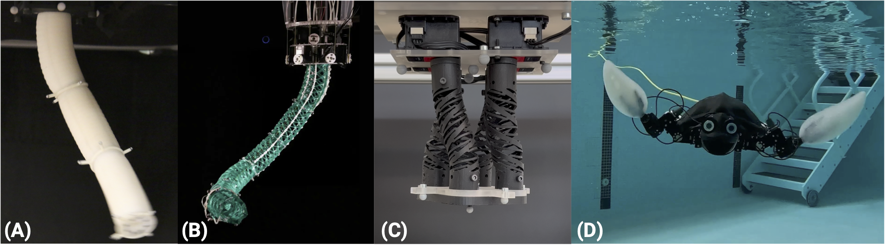

# 📘 Safe yet Precise Soft Robots: Incorporating Physics into Learned Models for Control

<p align="center">
  
</p>

[](https://doi.org/10.4233/uuid:24c1f667-8fd6-431a-bb78-11d22f8cb3da)
[](https://doi.org/10.4121/A9EE4280-4EF1-4C2B-BCEF-526CD50292A9)

## 🔗 Online Access

- Thesis (DOI): <https://doi.org/10.4233/uuid:24c1f667-8fd6-431a-bb78-11d22f8cb3da>
- TU Delft Repository Page: <https://research.tudelft.nl/en/publications/safe-yet-precise-soft-robots-incorporating-physics-into-learned-m>
- Associated Data (DOI): <https://doi.org/10.4121/A9EE4280-4EF1-4C2B-BCEF-526CD50292A9>

## 🔍 Abstract

This thesis tackles the long-standing safety–precision trade-off in continuum soft robots by coupling physically structured learned models with interpretable, closed-form, stability-guaranteed controllers that run at high rates without MPC. After motivating limits of first-principles models and direct policy learning, the work advances four technical fronts: (i) a quantitative safety metric for soft-robot interaction; (ii) shape sensing that fuses kinematic priors with commercial vision and magnetic sensors via nonlinear optimization, SLAM, and a learned measurement model; (iii) actuation modeling for auxetic-metamaterial (“HSA”) and piston-driven pneumatic robots, yielding provably stable controllers—an integral-saturated PID with potential shaping and Cartesian impedance for planar HSA systems, and a backstepping design for pneumatic actuation—and highlighting hysteresis effects that motivate learning; and (iv) learning methods that embed kinetic and potential energy structure into dynamics identification, including (a) extraction of low-dimensional strain models from backbone-shape evolution and (b) latent-space dynamics realized as coupled harmonic oscillator networks, enabling Lyapunov analysis and energy-shaping control. Beyond low-level control, the thesis demonstrates compliant behaviors via motor-imagery EEG guidance combined with operational-space impedance control, and a time-free, orbitally stable latent dynamical system for learning periodic motions from demonstration. The proposed models, sensing pipelines, and controllers are validated in simulation and on hardware, with code and data released, charting a path to soft robots that are both safe and precise in human-centric settings.

## 📖 Citation

If you use this work, please cite the thesis:

```bibtex
@phdthesis{stolzle2025phdthesis,
  title = "Safe yet Precise Soft Robots: Incorporating Physics into Learned Models for Control",
  keywords = "Soft Robotics, Nonlinear Control, Machine Learning, Artificial Intelligence",
  author = "Maximilian St{\"o}lzle",
  year = "2025",
  month = "9",
  day = "15",
  language = "English",
  type = "Dissertation (TU Delft)",
  school = "Mechanical Engineering, Delft University of Technology",
  doi = "10.4233/uuid:24c1f667-8fd6-431a-bb78-11d22f8cb3da",
  isbn = "978-94-6384-836-7",
}
```

## 🧭 Visual Overview

<p align="center">
  
  <br/>
  <em>Topics covered in this thesis: leveraging learned models for the control of soft robots.</em>
</p>

<p align="center">
  
  <br/>
  <em>Thesis outline highlighting the models’ physical priors and their application areas: proprioception / shape sensing, control, motion generation / policies, and HRI.</em>
</p>

<p align="center">
  
  <br/>
  <em><strong>Core Contribution of this Thesis.</strong> Learned dynamical models endowed with physical structure (kinetic + potential energies) enable closed-form energy-shaping + P-satI-D control: a potential-shaping feedforward for setpoint regulation plus an integral-saturated PID feedback term for disturbance rejection and robustness, while retaining interpretability for Lyapunov stability analysis.</em>
</p>

<p align="center">
  
  <br/>
  <em>Soft robot prototypes used for experimental validation. (A) Three-segment pneumatic continuum soft robot (silicone, three air cavities/segment). (B) Tendon-driven helicoid multi-segment continuum robot (Helix Robot). (C) HSA soft robot: 3D-printed auxetic metamaterial rods driven by four servo motors. (D) Hybrid turtle robot with rigid body and soft-rigid flipper limbs.</em>
</p>

## 🏗️ Key Contributions (Detailed Summary)

Core Contribution:
Safe and precise soft robot control via closed-form energy-shaping controllers that exploit physically structured learned models (kinetic + potential energy terms) to achieve interpretable, stable, and computationally efficient regulation.

1. Quantitative Safety Metric for Soft Robots:
  First metric (SRISC / SRDHC variants) capturing the safety of soft robots by accounting for continuum deformability, elasticity, and contact along the body; informs safe morphology and control design.
2. Kinematics-Guided Shape Sensing:
  Two approaches: (a) vision + vSLAM + projection onto kinematic model to curb drift; (b) magnetic proprioception combining a kinematic prior with a learned sensor model solved via optimization.
3. Advanced Actuation Modeling & Control:
  Physics-based kinematic, dynamic, and actuation models for auxetic HSA robots (incl. SPCS parameterization, planar model, inverse kinematics, Euler–Lagrange dynamics) and impedance + P-satI-D + potential shaping controllers; coupled piston–continuum pneumatic model with backstepping controller integrating actuator dynamics.
4. Physically Structured Learned Models:
  (a) Data-driven identification of PCS strain + dynamics (automatic segmentation, basis-function Euler–Lagrange representation, closed-form parameter identification, DOF pruning); (b) Coupled Oscillator Network (CON) latent dynamics for high-dimensional observations with mechanical interpretation, Lyapunov-proved GAS / ISS, and fast rollout approximation.
5. Closed-Form Model-Based Control with Learned Models:
  Integral-saturated PID (P-satI-D) feedback + potential compensation at target state; reshapes potential energy for setpoint regulation while retaining robustness to model mismatch; validated on physics-based HSA model, learned strain model, and latent CON dynamics.
6. High-Level Compliant Motion Behaviors:
  (a) Brain–machine interface (wearable 3-channel EEG) guiding planar HSA impedance controller via dual binary classifiers; (b) Time-free periodic motion learning using bijective encoder + Hopf bifurcation latent dynamics (stable motion policy) validated across multiple platforms.
7. Experimental Validation & Open Science:
  Extensive simulation + hardware experiments across multiple soft robot embodiments; release of code and datasets (see Data DOI) to foster reproducibility.

## 📂 Repository Layout (Selected)

| Path | Description |
|------|-------------|
| `dissertation.tex` | Main LaTeX driver file. |
| `dissertation.cls` | Customized TU Delft thesis class. |
| `propositions.tex` | Propositions document. |
| `introduction/`, `background/`, ... | Chapter source directories with `figures/` and `sections/`. |
| `appendix-*` | Appendices. |
| `cover/` | Front & back cover PDFs. |
| `fonts/` | Embedded font files (Libertinus, Inconsolata, etc.). |
| `Makefile` | Convenience build targets (PDF & print versions). |

## 🛠️ Build & Compilation

Prerequisites: A TeX Live (or MiKTeX) distribution with XeLaTeX, `latexmk`, `bibtex`, `makeglossaries`, Ghostscript (for print PDF), and required packages (see original TU Delft list). Install fonts (Libertinus, Inconsolata) on macOS if not already present (they are also bundled under `fonts/`).

### Quick Start (Recommended)

```bash
make            # builds dissertation.pdf, propositions.pdf, dissertation_print.pdf
```

### Manual Steps

```bash
latexmk -xelatex dissertation
bibtex dissertation          # repeat per chapter if using per-chapter bibliographies
makeglossaries dissertation
latexmk -xelatex dissertation
latexmk -xelatex dissertation
```

### Propositions Only

```bash
latexmk -xelatex propositions
```

### High-Quality Print Version (embeds all fonts)

```bash
make dissertation_print.pdf
```

### Cleaning

```bash
make clean
```


## 🧪 Reproducibility & Data

Most chapter-specific code and datasets are released (see Data DOI). Each sub-project repository (referenced therein) includes instructions for reproducing experiments, simulations, learned models, and controllers.

## 🙏 Acknowledgements

This repository builds upon an improved TU Delft thesis template. Please retain attribution where applicable.

## 📜 License

This work is licensed under a Creative Commons Attribution (CC BY 4.0) License. You are free to share and adapt with proper attribution.

Badge: [](https://creativecommons.org/licenses/by/4.0/)

---
✨ Enjoy exploring the thesis materials. Contributions via issues or pull requests (typos, minor improvements) are welcome.
